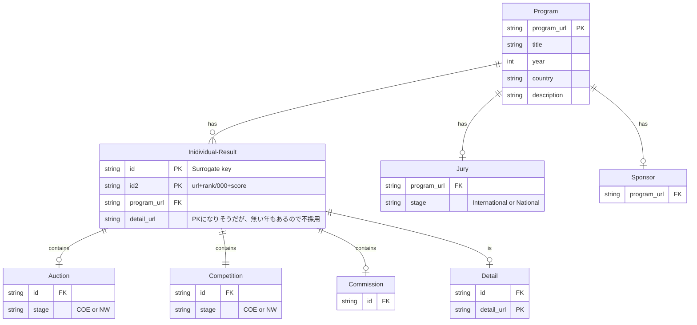

```mermaid
erDiagram
    Program ||--o{ Inidividual-Result : has
    Inidividual-Result ||--o| Auction : contains
    Inidividual-Result ||--|| Competition : contains
    Inidividual-Result ||--o| Commission : contains
    Inidividual-Result ||--o| Detail : is
    Program ||--o| Jury : has
    Program ||--o| Sponsor : has

    Program {
        string program_url PK
        string title
        int year
        string country
        string description
    }
    Inidividual-Result {
        string id PK "Surrogate key"
        string id2 PK "url+rank/000+score"
        string program_url FK
        string detail_url "PKになりそうだが、無い年もあるので不採用"
    }
    Auction {
        string id FK
        string stage "COE or NW"
    }
    Competition {
        string id FK
        string stage "COE or NW"
    }
    Commission {
        string id FK
    }
    Detail {
        string id FK
        string detail_url PK
    }
    Jury {
        string program_url FK
        string stage  "International or National"
    }
    Sponsor {
        string program_url FK
    }
```