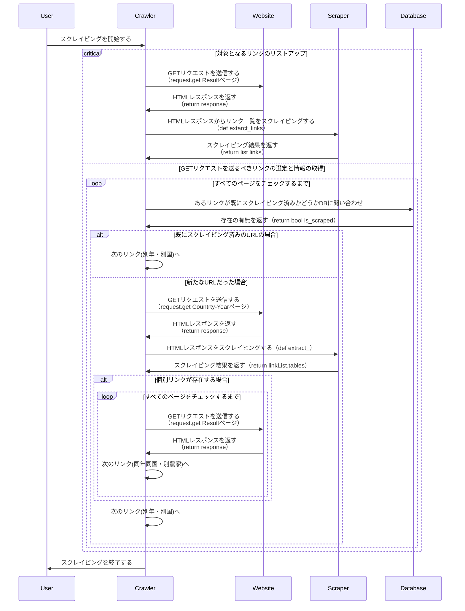

```mermaid
sequenceDiagram
	participant User
	participant Crawler
	participant Website
	participant Scraper
	participant Database

	User->>Crawler: スクレイピングを開始する

	critical 対象となるリンクのリストアップ
	%% target Resultリンク
		Crawler->>Website: GETリクエストを送信する<br/>（request.get Resultページ）
		Website->>Crawler: HTMLレスポンスを返す<br/>（return response）
		Crawler->>Scraper: HTMLレスポンスからリンク一覧をスクレイピングする<br/>（def extarct_links）
		Scraper->>Crawler: スクレイピング結果を返す<br/>（return list links）
	  
	option GETリクエストを送るべきリンクの選定と情報の取得
	%% target Countrty-Yearリンク
		loop すべてのページをチェックするまで
			Crawler->>Database: あるリンクが既にスクレイピング済みかどうかDBに問い合わせ
			Database->>Crawler: 存在の有無を返す（return bool is_scraped）

			alt 既にスクレイピング済みのURLの場合
				Crawler->>Crawler:次のリンク(別年・別国)へ
	        
			else 新たなURLだった場合
				Crawler->>Website: GETリクエストを送信する<br/>（request.get Countrty-Yearページ）
				Website->>Crawler: HTMLレスポンスを返す<br/>（return response）
				Crawler->>Scraper: HTMLレスポンスをスクレイピングする（def extract_）
				Scraper->>Crawler: スクレイピング結果を返す（return linkList,tables）
				
				alt 個別リンクが存在する場合
					loop すべてのページをチェックするまで
						Crawler->>Website: GETリクエストを送信する<br/>（request.get Resultページ）
						Website->>Crawler: HTMLレスポンスを返す<br/>（return response）
						Crawler->>Crawler:次のリンク(同年同国・別農家)へ
					end
				end
				Crawler->>Crawler:次のリンク(別年・別国)へ
			end
	    end
	end
	Crawler->>User: スクレイピングを終了する
```